<!-- _class: cover -->

여러 .NET 구현과 플랫폼을 두루 지원하는 라이브러리 *오픈 소스로* 만들기
=========================================================

플라네타리움 <planetariumhq.com>
홍민희 <hongminhee.org>

---

<!-- _class: image -->

[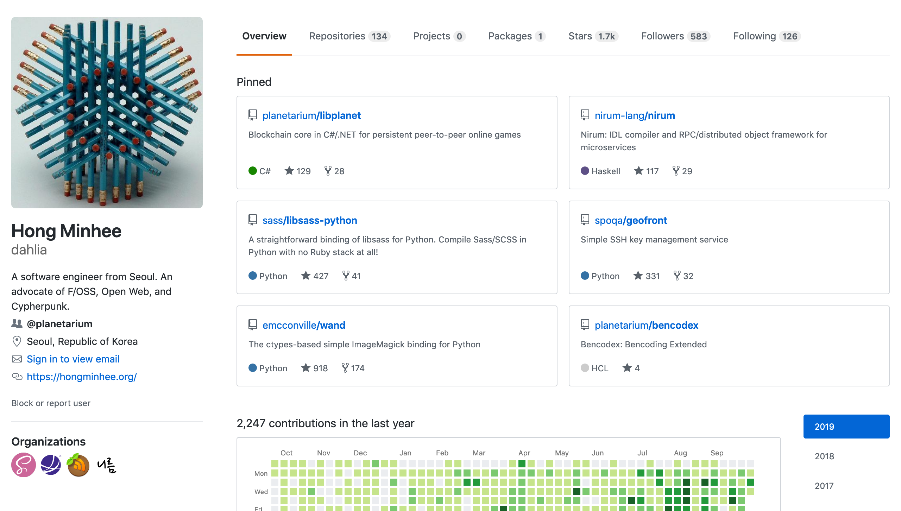](https://github.com/dahlia)

<!-- 연사 소개. -->

---

[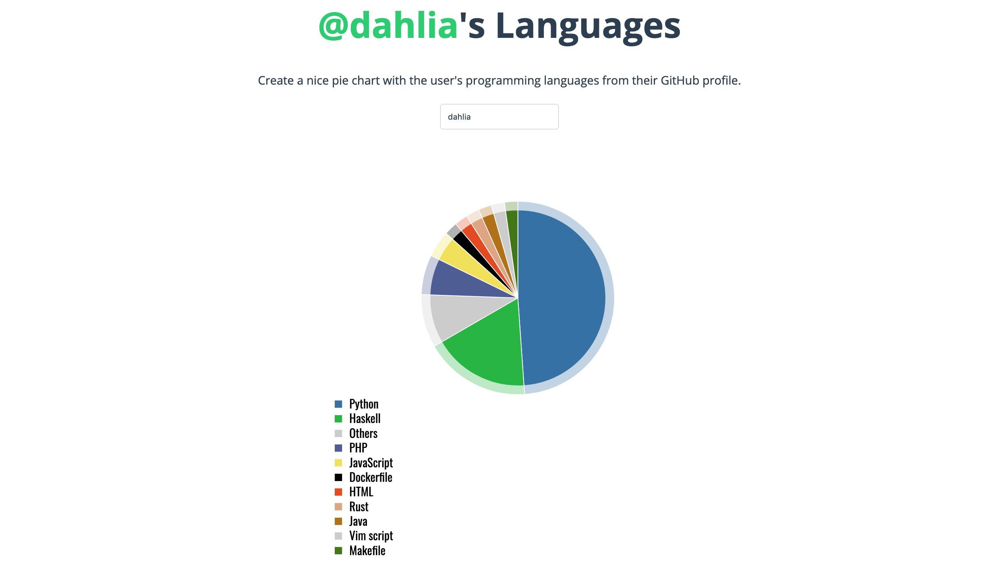](http://ionicabizau.github.io/github-profile-languages/?user=dahlia)

<!-- 여태 파이썬을 주로 써왔는데 왜 .NET을 썼는지? -->

---

2018년 여름
===========

 *  고전 게임은 30년이 지나도 어떻게든 즐길 수 있는데,  
    온라인 멀티플레이어 게임도 그럴 수 있을까?

 *  고전 게임은 세이브 파일만 잘 백업하면 나중에라도 이어서 할 수 있는데,
    온라인 멀티플레이어 게임은?

---

<!-- _class: image -->

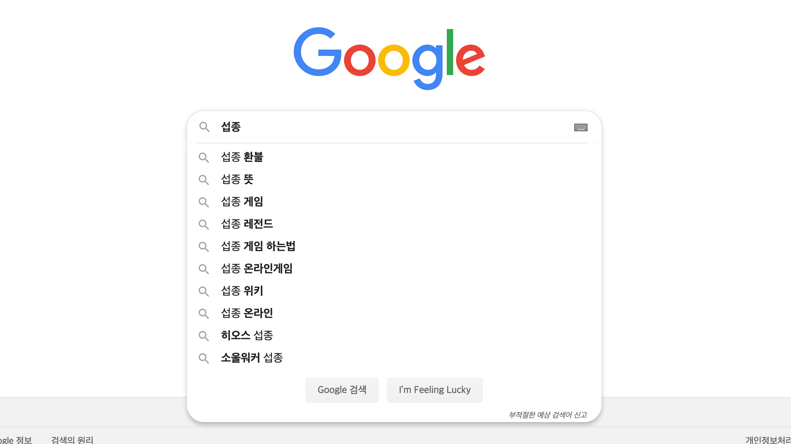

<!-- 실제로 섭종을 아쉬워 하는 사람은 많다. -->

---

(세간에서의 뜻과는 다르지만)
서버리스 온라인 멀티플레이어 게임 만들기
========================================

---

Libplanet
=========

https://libplanet.io/

 *  게임에서 갖다 쓸 수 있는 네트워크 및 스토리지 라이브러리.
 *  중앙에서 누군가(≅ 게임사)가 서버를 운영하는 대신, 비트토렌트처럼 게이머의 기기끼리 통신.
 *  다음을 위해 블록체인 기술을 구현:
     * 모든 플레이어가 일관된 상태를 볼 수 있도록 (BFT 합의).
     * 중앙의 관계형 데이터베이스 등을 쓰지 않고도 영속성을 구현할 수 있도록.
     * 잠재적 악의적 플레이어(핵 유저, 치터)가 있어도 합의된 세계가 변조되지 않도록.

---

왜 .NET으로? 사고의 흐름
============================

 *  가장 많이 써본 언어는 파이썬이지만, 서버를 만드려는 게 아니다.
 *  기본적으로 게임 (소위) “클라이언트”끼리 알아서 모든 것을 다 해야 한다.
 *  즉, 게임 엔진과 더불어 살며 돌 라이브러리를 만들어야 한다.
 *  요즘 게임은 어떤 엔진이나 언어로 많이 만들지?
 *  역시 C++이 답인가?
     *  솔직히 달갑지 않다.
     *  게임 엔진처럼 프레임워크·엔진도 아닌, 라이브러리를 C++로 만들 자신도 없다.

---

<!-- _class: image -->

[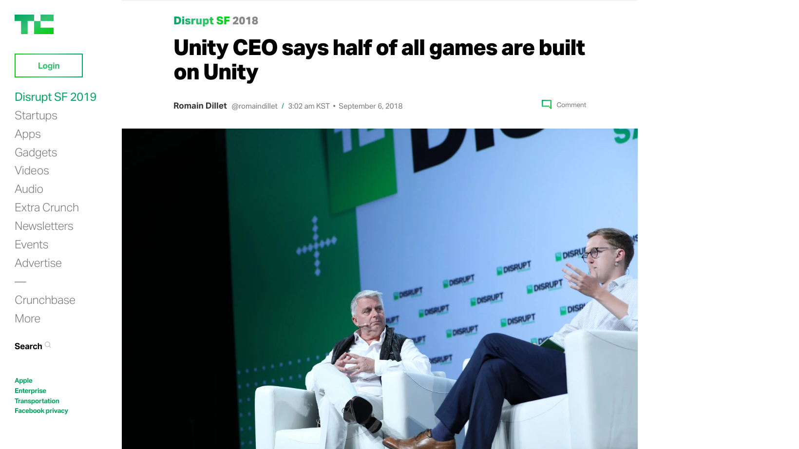](https://tcrn.ch/2ClQTGr)

<!-- 새로 나오는 게임의 반 정도는 Unity로 만들어진다고 한다. -->

---

왜 Unity 플러그인이 아닌 .NET 라이브러리로?
===========================================

 *  Unity 외에도 C# 스크립팅을 지원하거나 .NET 기반의 게임 엔진은 많다.
 *  블록 익스플로러 같은 주변 도구들을 만들 때 도움이 된다.

---

다양한 .NET 구현들
==================

 -  .NET Framework
 -  Mono ← Unity가 내부적으로 쓰는 VM
 -  UWP
 -  Xamarin (iOS, macOS, Android)
 -  .NET Core

---

[.NET Standard](https://docs.microsoft.com/en-us/dotnet/standard/net-standard)
===============

<!-- _class: table -->

| .NET Standard     | 1.0    | 1.1    | 1.2    | 1.3    | 1.4    | 1.5        | 1.6        | 2.0        |
|-------------------|--------|--------|--------|--------|--------|------------|------------|------------|
| .NET Core         | 1.0    | 1.0    | 1.0    | 1.0    | 1.0    | 1.0        | 1.0        | 2.0        |
| .NET Framework    | 4.5    | 4.5    | 4.5.1  | 4.6    | 4.6.1  | 4.6.1 2    | 4.6.1 2    | 4.6.1 2    |
| Mono              | 4.6    | 4.6    | 4.6    | 4.6    | 4.6    | 4.6        | 4.6        | 5.4        |
| Xamarin (iOS)     | 10.0   | 10.0   | 10.0   | 10.0   | 10.0   | 10.0       | 10.0       | 10.14      |
| Xamarin (macOS)   | 3.0    | 3.0    | 3.0    | 3.0    | 3.0    | 3.0        | 3.0        | 3.8        |
| Xamarin (Android) | 7.0    | 7.0    | 7.0    | 7.0    | 7.0    | 7.0        | 7.0        | 8.0        |
| UWP               | 10.0   | 10.0   | 10.0   | 10.0   | 10.0   | 10.0.16299 | 10.0.16299 | 10.0.16299 |
| Unity             | 2018.1 | 2018.1 | 2018.1 | 2018.1 | 2018.1 | 2018.1     | 2018.1     | 2018.1     |

---

<!-- _class: image -->

[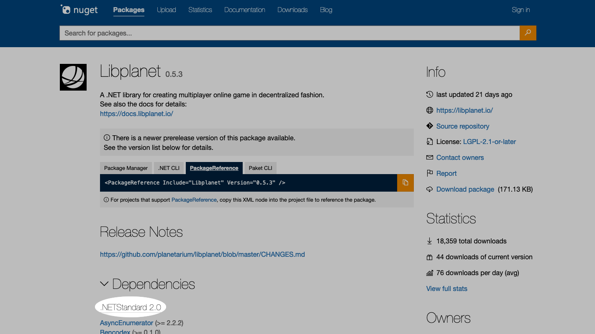](https://www.nuget.org/packages/Libplanet/)

<!-- Libplanet도 .NET Standard 2.0을 타깃한다. 아쉽게도 Unity는 아직 .NET Standard 2.1 지원 안 하고 있음. -->

---

다양한 OS
=========

 -  Linux
 -  macOS
 -  Windows

모바일도 합치면:

 -  Android
 -  iOS 및 iPadOS

<!-- 하지만 아직은 모바일까지 테스트하고 있지는 못하다. 추후 추가 예정 있음. -->

---

<!-- _class: image -->

[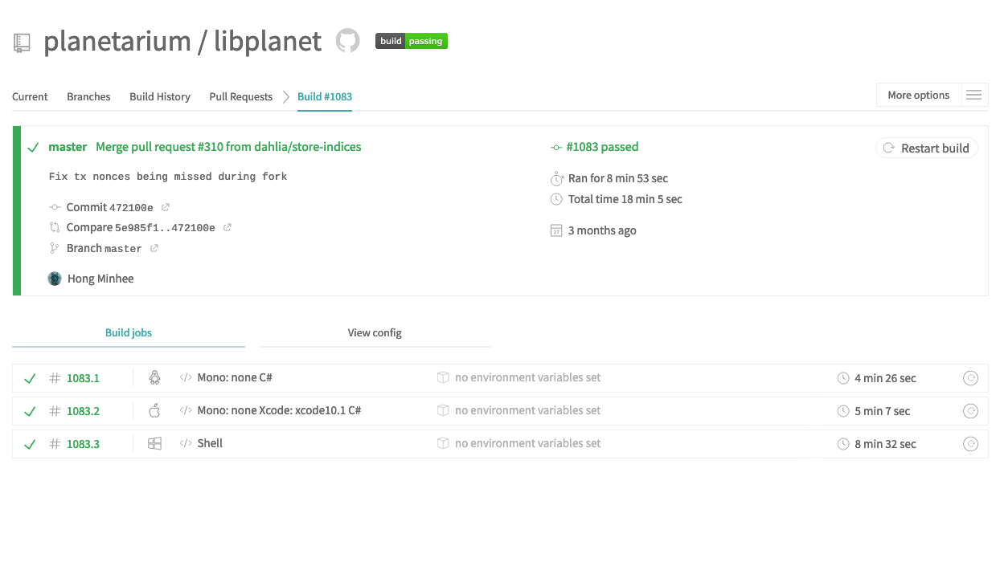](https://travis-ci.com/planetarium/libplanet/builds/117367234)

---

(Linux, macOS, Windows) × (.NET Core, Mono)
\+ .NET Framework
===========================================

<!-- .NET Framework는 Windows에서밖에 안 되니까 별도로 추가. -->

---

<!-- _class: image -->

[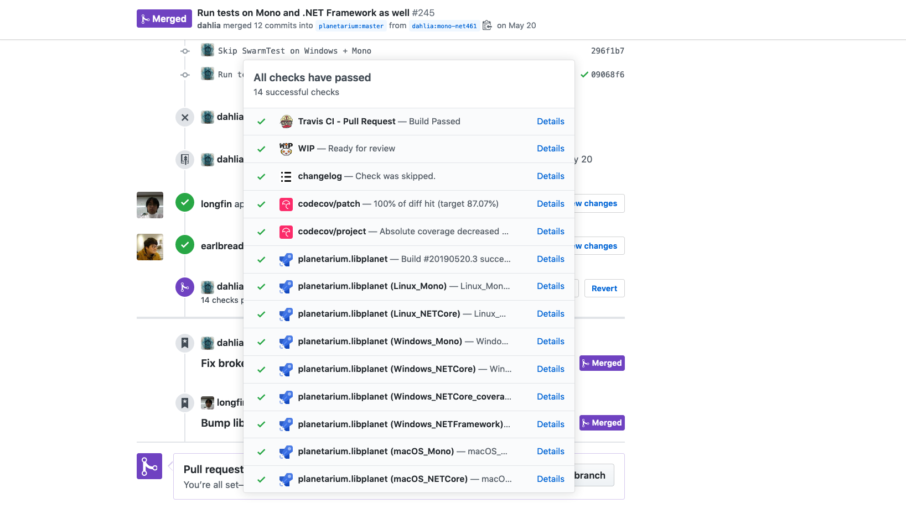](https://github.com/planetarium/libplanet/pull/245)

---

Unity
=====

 *  한동안 CI의 빽빽한 초록불에 심리적 안정을 찾았으나…
 *  실제로 만드는 게임에서만 나타나는 현상들이 자꾸 보고된다.
 *  분명 Mono에서는 괜찮은데 Unity에서 왜 문제가? 좀 옛날 버전의 Mono를 쓰는 걸까?

---

<!-- _class: image -->

[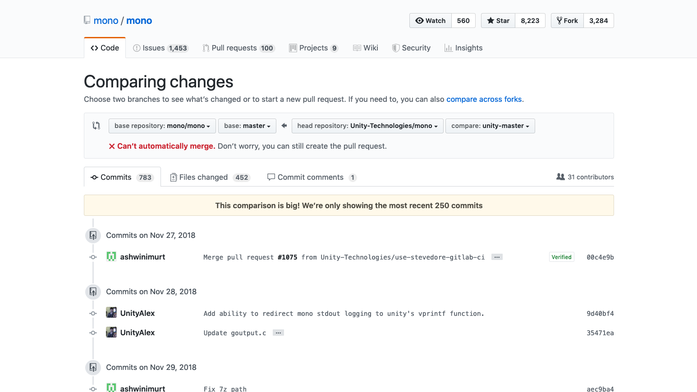](https://github.com/mono/mono/compare/master...Unity-Technologies:unity-master)

<!-- 실제로 Unity는 공식 GitHub 계정에서 자신들의 Mono 포크를 공개하고 있다. -->

---

<!-- _class: image -->

[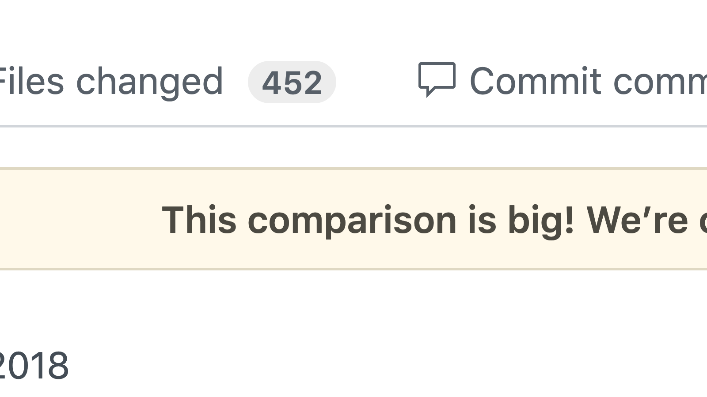](https://github.com/mono/mono/compare/master...Unity-Technologies:unity-master)

<!-- 그리고 이미 상당한 다운스트림 패치가 쌓여있다. -->

---

Unity
=====

동작이 다를 이유는 많다.

 -  상당한 다운스트림 패치가 적용된 별개의 Unity 내장 Mono
 -  Unity가 이미 깔아둔 메인 루프
 -  IL2CPP (Intermediate Language To C++)

<!-- TODO: 많다고는 했는데 막상 떠오르지가 않는다. -->

---

xunit-unity-runner
==================

github.com/planetarium/xunit-unity-runner

 -  Unity에 NUnit 실행기는 내장되어 있지만 Libplanet은 Xunit을 써서… 😭
 -  Unity 플레이어 환경에서 Xunit 테스트를 실행
 -  실제로 Mono에서 xunit.console.exe로 테스트를 실행할 때와 결과가 종종 다름

---

<!-- _class: image -->

[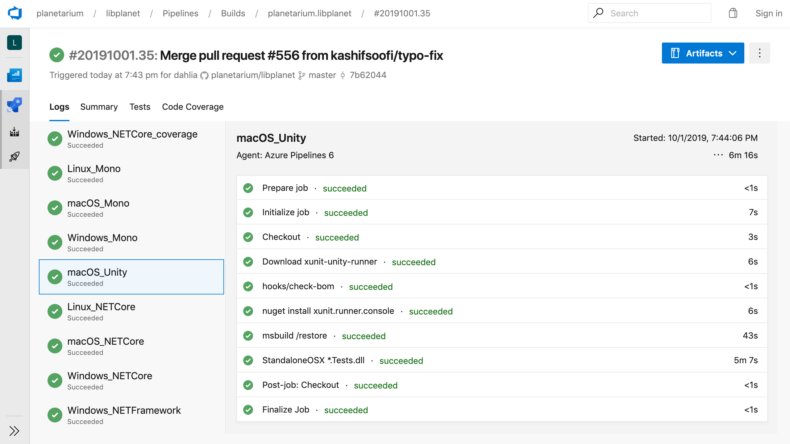](https://github.com/planetarium/libplanet/pull/245)

<!-- 아직 Windows는 CI에서 자동화가 힘들어서 아직 못 했고,
Linux는 Unity가 Linux를 공식 지원하지 않아서 매끄럽게 되지 않는다.
추후 Linux와 Windows에서도 테스트를 돌릴 계획. -->

---

하지만 언젠가는 Unity가 .NET Core 기반으로 바뀌었으면 😇
========================================================

---

개발 환경의 일관성
==================

 *  전통적으로 IDE 친화적이었던 .NET 및 Windows 개발 문화
 *  GUI 중심의 워크플로우가 기본, CLI는 있으면 좋은 정도
 *  개발 환경의 간소화나 재현성이 아주 중요시되는 분위기는 아님
 *  개발하는 사람들의 환경의 일관성이 높다고 가정
 *  일관성이 보장되면 아주 편하기 때문에 보통의 팀에서는 일관성을 추구하는 것이 좋긴 한데…

---

개발 환경의 다양성
==================

 *  하지만 오픈 소스 프로젝트의 기여자들한테 우리가 월급을 주는 것도 아니고…
 *  기여하려면 꼭 Windows 사서 Visual Studio 설치하라고 할 수도 없고…

---

<!-- _class: image -->

[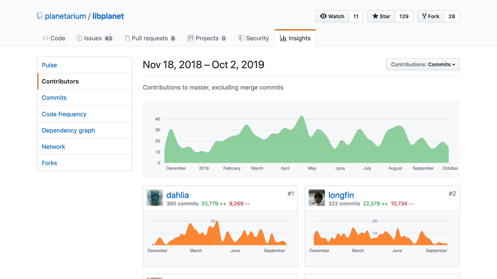](https://github.com/planetarium/libplanet/graphs/contributors)

---

<!-- _class: image -->

[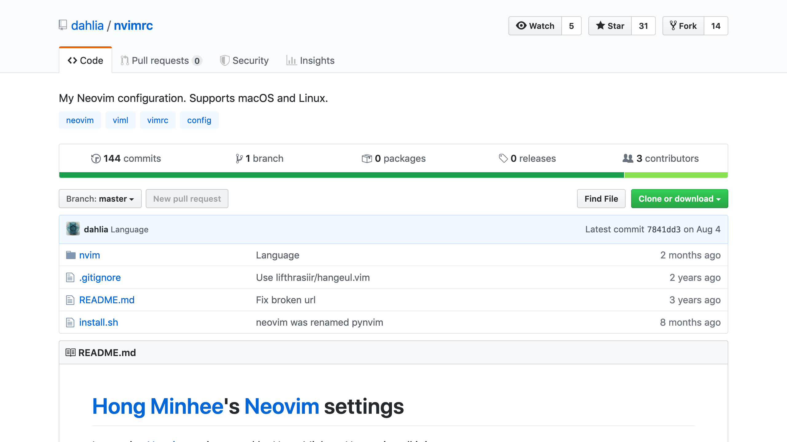](https://github.com/dahlia/nvimrc)

<!-- 한 명은 원래 Vim을 쓰던 사람이고… -->

---

<!-- _class: image -->

[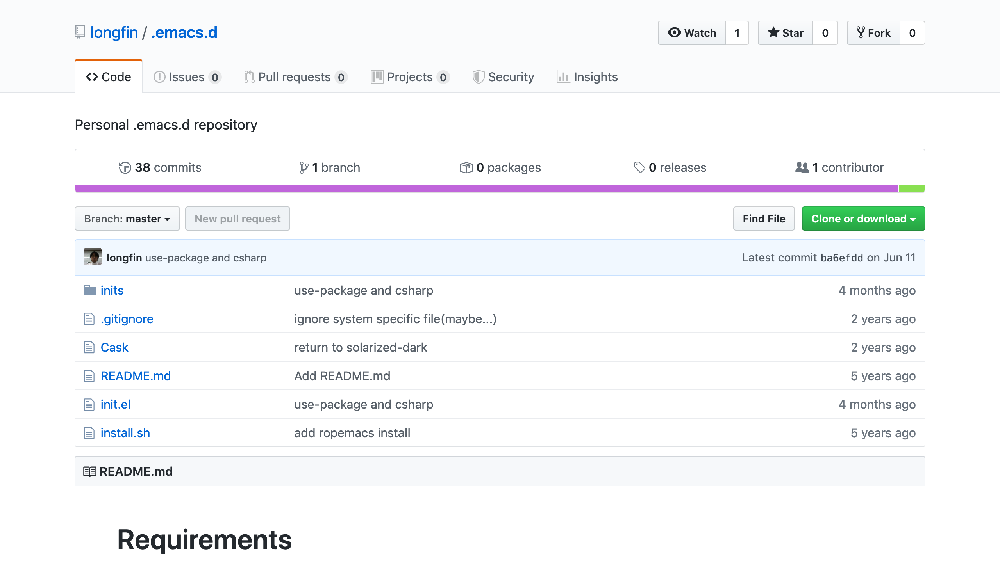](https://github.com/longfin/.emacs.d)

<!-- 다른 한 사람은 Emacs 쓰던 사람. -->

---

개발 환경의 다양성
==================

 -  하지만 오픈 소스 프로젝트의 기여자들한테 우리가 월급을 주는 것도 아니고…
 -  기여하려면 꼭 Windows 사서 Visual Studio 설치하라고 할 수도 없고…
 -  아무튼 아주 편하게 돌아가는 단 하나의 환경을 구축하는 것보다,  
    여러 환경에서 똑같이 빌드할 수 있는 방법을 찾는 것부터 하자.

---

EditorConfig
============

IDE나 코드 편집기가 그 프로젝트의 (최소한의) 코드 스타일을 따르게 해준다.

 -  하드탭·소프트탭 여부
 -  들여 쓰기는 한 단계에 몇 칸으로 넣을지
 -  줄 당 최대 폭
 -  파일 마지막에 `LF` (EOL) 문자를 넣을지
 -  빈 줄에 들여쓰기를 위한 공백 문자를 남길지
 -  매 줄의 마지막 공백 문자들을 남길지

등등의 별 것도 아닌데 괜히 신경 쓰일 수 있는 것들을 자동으로 맞출 수 있다.

---

~~~~ ini
root = true

[*]
charset = utf-8
end_of_line = lf
insert_final_newline = true
tab_width = 8
trim_trailing_whitespace = true
~~~~

<!-- 인코딩이나 들여쓰기에 쓸 문자, 들여쓰기 폭 등의 기본적인 설정. -->

---

~~~~ ini
[*.{cs,csproj,md,xml}]
indent_style = space
continuation_indent_size = 4

[*.{cs,md,xml}]
max_line_length = 100

[*.{cs,md}]
indent_size = 4

[{*.{ps1,sh},hooks/*}]
indent_size = 2

[*.{csproj,xml}]
indent_size = 2
quote_type = double
~~~~

<!-- 파일 종류마다 다른 설정이 적용 가능하고,
한 줄 당 최대 폭이나 홑따옴표나 쌍따옴표 중에 어떤 쪽으로 통일할 것인지 등을 정할 수 있다. -->

---

~~~~ ini
[*.cs]
curly_bracket_next_line = true
spaces_around_operators = true
indent_brace_style = Allman
dotnet_naming_rule.public_members_must_be_capitalized.symbols =
    public_symbols
dotnet_naming_symbols.public_symbols.applicable_kinds =
    property,method,field,event,delegate
dotnet_naming_symbols.public_symbols.applicable_accessibilities =
    public
dotnet_naming_rule.public_members_must_be_capitalized.style =
    first_word_upper_case_style
dotnet_naming_style.first_word_upper_case_style.capitalization =
    first_word_upper
dotnet_naming_rule.public_members_must_be_capitalized.severity =
    warning
~~~~

<!-- .NET만을 위한 속성들도 있다. 모든 코드 편집기나 IDE에서 지원하는 것은 아니지만,
어차피 서식을 아예 강제하는 것은 CI에서 별도의 처리가 필요하다. 뒤쪽에서 언급 예정. -->

---

[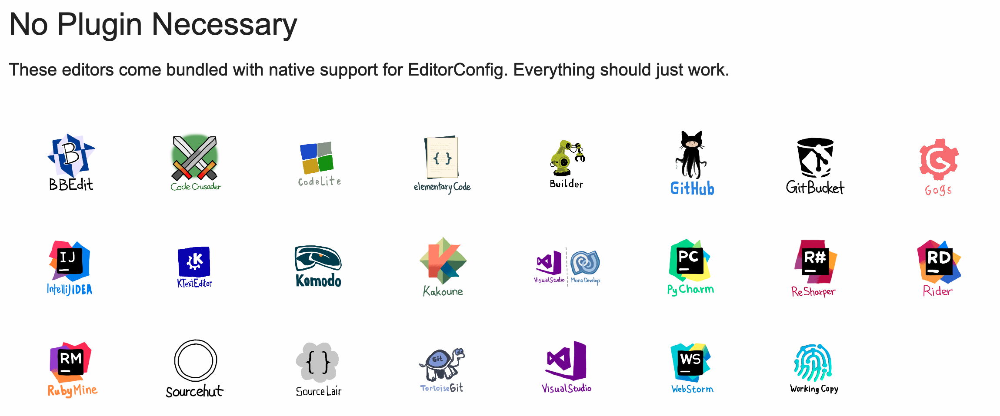](https://editorconfig.org/#download)

<!-- 이미 꽤 많은 코드 편집기나 IDE가 EditorConfig를 기본적으로 인식하고 있다.
VisualStudio나 Rider도 EditorConfig 지원이 내장되어 있다. -->

---

Roslyn Analyzers
================

 *  코먼 리스프의 매크로에 대한 .NET의 대답
 *  컴파일러 내부의 하이레벨 API인 Roslyn를 통해 코드를 읽거나 고칠 수 있다.
     *  C 전처리기 같은 토큰 수준 접근
     *  코먼 리스프 매크로 같은 구문 트리(AST) 수준 접근
     *  리플렉션 API 같은 의미론 수준 접근 (런타임 말고 빌드 시점)
     *  IL 바이트코드 수준에서도 조작 가능
 *  만든 Roslyn analyzer는 NuGet으로 배포 가능. 높은 재사용성
 *  근데 그래서 만들어 썼다는 얘기는 아니고… (아직)
 *  만들어진 Roslyn analyzer는 NuGet 의존성으로 설치하면 바로 동작 👍

---

StyleCop.Analyzers
==================

github.com/DotNetAnalyzers/StyleCopAnalyzers

 *  옛날부터 쓰이던 StyleCop의 규칙들을 Roslyn analyzer로 재구현한 패키지
 *  들여쓰기, 줄바꿈, 공백 문자, 텍스트 인코딩 등의 규칙
 *  괄호 위치, 필요 없는 괄호 제거, 우선 순위가 모호한 연산자는 괄호 강제
 *  클래스나 멤버 등의 이름 규칙
 *  선언이나 `using`문의 나열 순서
 *  XML 문서 누락됐는지 체크
 *  세부적인 규칙 각각을 켜거나 끌 수 있음

---

Menees.Analyzers
================

menees.com/Analyzers.htm

 *  StyleCop에 없는 규칙이나 StyleCop의 규칙과 반대의 규칙을 구현
 *  Libplanet에서는 한 줄 당 최대 폭을 강제하기 위해 이용

---

Microsoft.DotNet.Analyzers.Compatibility
========================================

github.com/dotnet/platform-compat

 *  특정 OS 종속적인 API를 쓰는지 체크
 *  [`RuntimeInformation.IsOSPlatform()`][1] 메서드를 써서 조건문으로 감싸면 그 안쪽은 무시
 *  폐기된(deprecated) API를 쓰는지 체크
 *  옛 .NET Framework (4.6.1) 또는 UWP에서 못 쓰는 API를 쓰는지 체크

[1]: https://docs.microsoft.com/en-us/dotnet/api/system.runtime.interopservices.runtimeinformation.isosplatform

---

테스트 코드 커버리지
====================

nuget.org/packages/Microsoft.CodeCoverage

~~~~ ps1
dotnet test --logger trx --collect "Code coverage"
CodeCoverage.exe analyze /output:report.xml *.coverage
~~~~

---

<!-- _class: image -->

[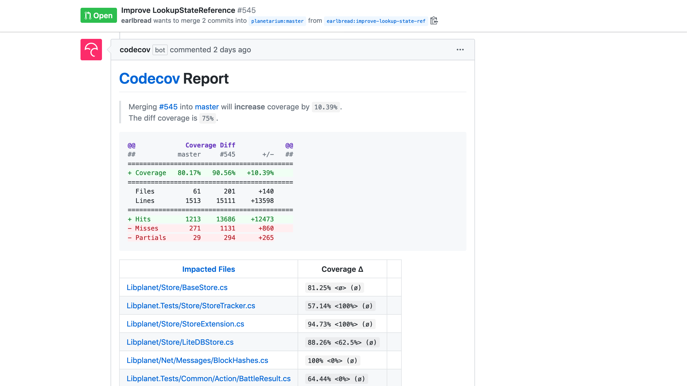](https://github.com/planetarium/libplanet/pull/545#issuecomment-536581831)

---

<!-- _class: image -->

[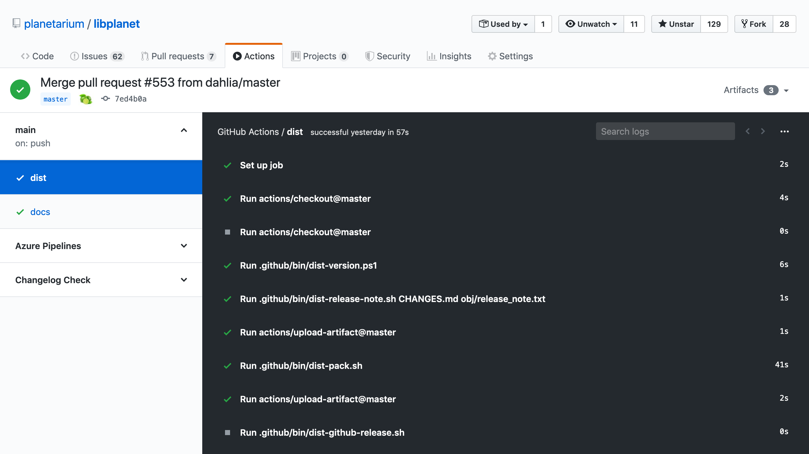](https://github.com/planetarium/libplanet/runs/242816661)

<!-- Git에 새 태그를 푸시하면 GitHub Actions로 릴리스 작업이 수행됨. -->

---

<!-- _class: image -->

[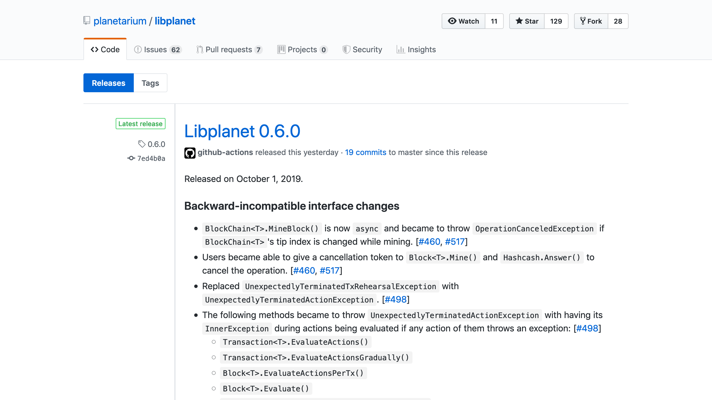](https://github.com/planetarium/libplanet/releases)

<!-- GitHub Releases에 새 릴리스가 올라가고, CHANGES.md 파일의 해당 버전 섹션을 추출해서 내용으로 채움. -->

---

<!-- _class: image -->

[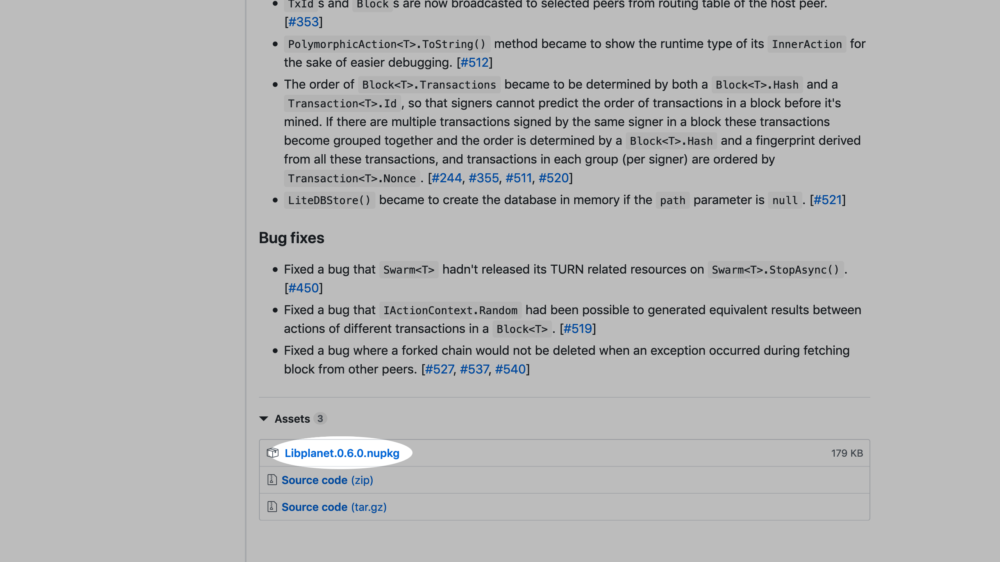](https://github.com/planetarium/libplanet/releases/tag/0.6.0)

<!-- 다운로드할 수 있도록 .nupkg 파일이 함께 첨부됨. -->

---

<!-- _class: image -->

[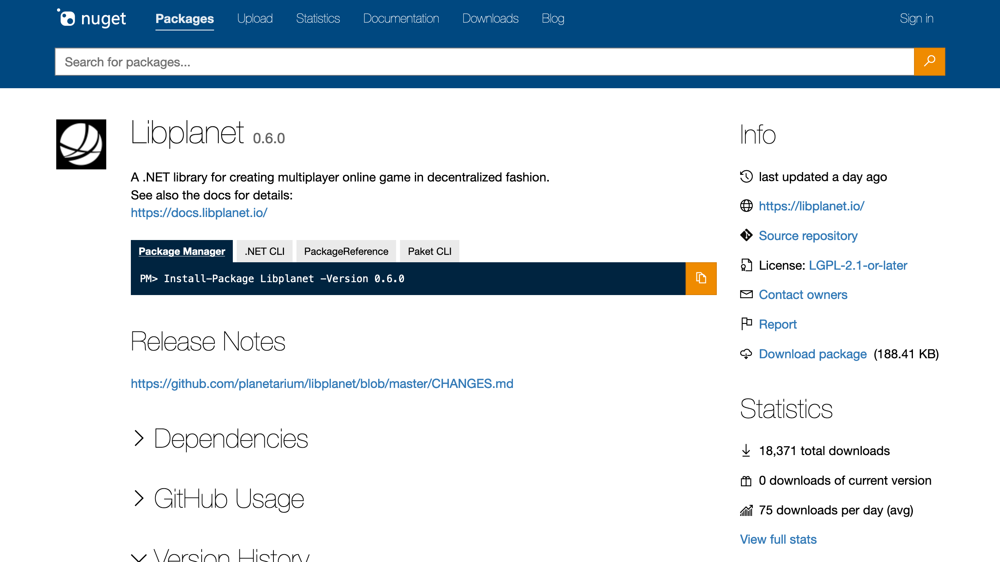](https://www.nuget.org/packages/Libplanet/)

<!-- NuGet에도 같이 올라감. -->

---

<!-- _class: image -->

[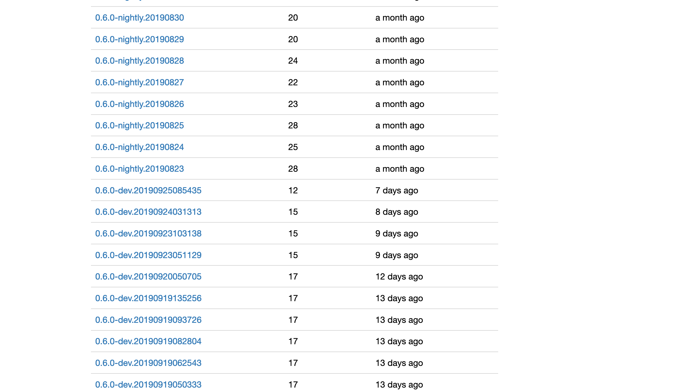](https://www.nuget.org/packages/Libplanet/)

<!-- 태그 푸시가 아니더라도 매 푸시가 프리릴리스 형식으로 NuGet에 올라가게 되어 있음. -->

---

<!-- _class: hiring -->

같이 일해요! bit.ly/plnt-hire-2019
============

발표 자료: bit.ly/hong-netconf-2019

<!--

- changelog-check

-->